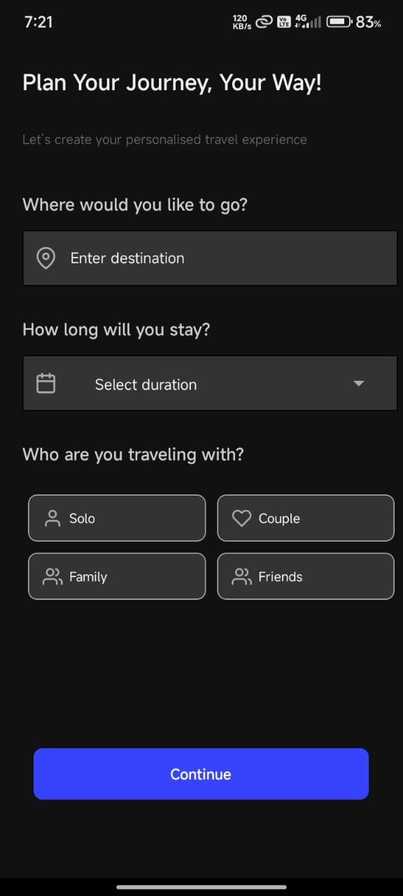
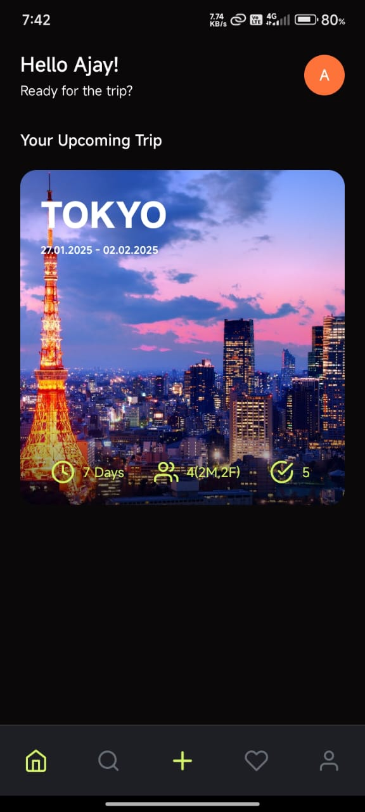

1. Onboarding Flow (Completed)
    
    Purpose: Introduce the app and collect initial user input.

   

   Destination: The place the user plans to visit.

   Duration: How long the trip will last.

   Group Type: Solo, Couple, Family, or Friends.

2. Main Dashboard (Partially Completed)
     
   
    Purpose: Display a trip summary with detailed sections:

   Transportation: Information on how the user will travel.

   Accommodation: Where the user will stay.

   Activities: List of things to do during the trip.
